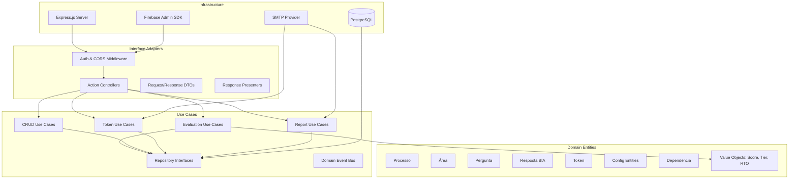
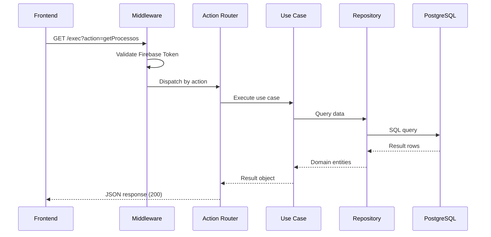
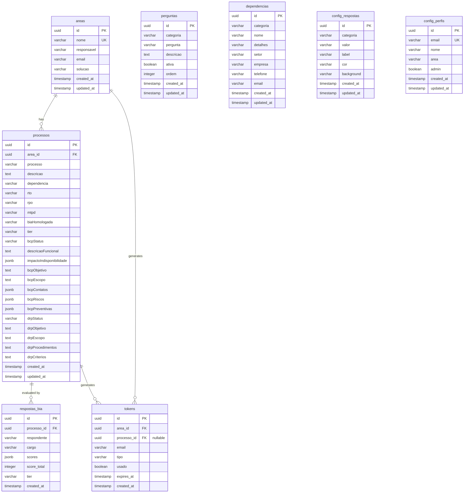

# Design Document: Backend Migration

## Overview

This design describes the migration of the BIA (Business Impact Analysis) application backend from Google Apps Script + Google Sheets to a Node.js/TypeScript API with PostgreSQL. The new backend follows Clean Architecture principles, uses Firebase Auth for authentication, and maintains full backward compatibility with the existing Firebase-hosted frontend.

The migration preserves the existing action-based routing pattern (GET via `action` query parameter, POST via `action` field in JSON body) so the frontend requires only a URL change in `config.js`. The system is designed for extensibility to support future phases: AI integration, automatic document generation, runbook automation, and NIST SP 800-34 compliance.

### Key Design Decisions

1. **Express.js** as the HTTP framework — lightweight, mature, well-suited for action-based routing
2. **TypeORM** as the ORM — supports PostgreSQL, migrations, decorators, and repository pattern
3. **Single endpoint routing** — a single `/exec` endpoint dispatches by `action` parameter to maintain frontend compatibility
4. **Firebase Admin SDK** for token verification — validates ID tokens server-side
5. **Nodemailer** with configurable SMTP for email — decouples from Gmail/Google APIs
6. **uuid** library for token generation — replaces `Utilities.getUuid()`
7. **tsyringe** for dependency injection — lightweight DI container for constructor injection

## Architecture

The system follows Clean Architecture with four concentric layers. Dependencies point inward only.



### Request Flow



### Directory Structure

```
bia-backend/
├── src/
│   ├── domain/
│   │   ├── entities/
│   │   │   ├── Area.ts
│   │   │   ├── Processo.ts
│   │   │   ├── Pergunta.ts
│   │   │   ├── RespostaBia.ts
│   │   │   ├── Token.ts
│   │   │   ├── Dependencia.ts
│   │   │   ├── ConfigResposta.ts
│   │   │   └── ConfigPerfil.ts
│   │   ├── value-objects/
│   │   │   ├── Score.ts
│   │   │   ├── Tier.ts
│   │   │   └── RTO.ts
│   │   ├── events/
│   │   │   ├── DomainEvent.ts
│   │   │   ├── EvaluationCompleted.ts
│   │   │   ├── ProcessCreated.ts
│   │   │   └── TierChanged.ts
│   │   └── errors/
│   │       ├── DomainError.ts
│   │       ├── TokenExpiredError.ts
│   │       ├── TokenUsedError.ts
│   │       └── UnauthorizedError.ts
│   ├── use-cases/
│   │   ├── interfaces/
│   │   │   ├── IAreaRepository.ts
│   │   │   ├── IProcessoRepository.ts
│   │   │   ├── IPerguntaRepository.ts
│   │   │   ├── IRespostaBiaRepository.ts
│   │   │   ├── ITokenRepository.ts
│   │   │   ├── IDependenciaRepository.ts
│   │   │   ├── IConfigRespostaRepository.ts
│   │   │   ├── IConfigPerfilRepository.ts
│   │   │   ├── IEmailService.ts
│   │   │   └── IEventBus.ts
│   │   ├── evaluation/
│   │   │   ├── SalvarRespostasUseCase.ts
│   │   │   ├── SalvarRespostasTokenUseCase.ts
│   │   │   ├── SalvarRespostasAreaUseCase.ts
│   │   │   └── GetResumoRespostasUseCase.ts
│   │   ├── token/
│   │   │   ├── GerarTokenUseCase.ts
│   │   │   ├── GerarTokenAreaUseCase.ts
│   │   │   ├── ValidarTokenUseCase.ts
│   │   │   └── ValidarTokenAreaUseCase.ts
│   │   ├── crud/
│   │   │   ├── PerguntaCrudUseCase.ts
│   │   │   ├── AreaCrudUseCase.ts
│   │   │   ├── ProcessoCrudUseCase.ts
│   │   │   ├── DependenciaCrudUseCase.ts
│   │   │   └── ConfigRespostaCrudUseCase.ts
│   │   ├── report/
│   │   │   └── GerarRelatorioAreaUseCase.ts
│   │   └── profile/
│   │       └── GetPerfilUseCase.ts
│   ├── adapters/
│   │   ├── controllers/
│   │   │   ├── ActionRouter.ts
│   │   │   ├── PerguntaController.ts
│   │   │   ├── AreaController.ts
│   │   │   ├── ProcessoController.ts
│   │   │   ├── EvaluationController.ts
│   │   │   ├── TokenController.ts
│   │   │   ├── ReportController.ts
│   │   │   ├── ConfigController.ts
│   │   │   └── DependenciaController.ts
│   │   ├── middleware/
│   │   │   ├── authMiddleware.ts
│   │   │   ├── corsMiddleware.ts
│   │   │   └── errorHandler.ts
│   │   ├── dtos/
│   │   │   ├── ProcessoResponseDto.ts
│   │   │   ├── AreaResponseDto.ts
│   │   │   └── ...
│   │   └── presenters/
│   │       └── LegacyResponsePresenter.ts
│   └── infrastructure/
│       ├── database/
│       │   ├── migrations/
│       │   ├── repositories/
│       │   │   ├── TypeOrmAreaRepository.ts
│       │   │   ├── TypeOrmProcessoRepository.ts
│       │   │   ├── TypeOrmPerguntaRepository.ts
│       │   │   ├── TypeOrmRespostaBiaRepository.ts
│       │   │   ├── TypeOrmTokenRepository.ts
│       │   │   ├── TypeOrmDependenciaRepository.ts
│       │   │   ├── TypeOrmConfigRespostaRepository.ts
│       │   │   └── TypeOrmConfigPerfilRepository.ts
│       │   └── data-source.ts
│       ├── email/
│       │   └── NodemailerEmailService.ts
│       ├── auth/
│       │   └── FirebaseAuthProvider.ts
│       ├── events/
│       │   └── InMemoryEventBus.ts
│       ├── logging/
│       │   └── StructuredLogger.ts
│       └── config/
│           └── env.ts
├── migrations/
├── tools/
│   └── migration/
│       └── SheetsMigrator.ts
├── Dockerfile
├── docker-compose.yml
├── tsconfig.json
├── package.json
└── openapi.yaml
```

## Components and Interfaces

### Domain Entities

#### Processo
```typescript
interface Processo {
  id: string;                          // UUID
  area_id: string;                     // FK to Area
  processo: string;                    // Process name
  descricao: string;                   // Impact description
  dependencia: string;                 // Critical dependency
  rto: string;                         // Recovery Time Objective
  rpo: string;                         // Recovery Point Objective
  mtpd: string;                        // Maximum Tolerable Period of Disruption
  biaHomologada: string;               // BIA approval status
  tier: string;                        // Tier classification
  bcpStatus: string;                   // BCP status
  descricaoFuncional: string;          // Functional description
  impactoIndisponibilidade: object;    // JSON - unavailability impact
  bcpObjetivo: string;                 // BCP objective
  bcpEscopo: string;                   // BCP scope
  bcpContatos: object[];               // JSON - BCP contacts
  bcpRiscos: object[];                 // JSON - BCP risks
  bcpPreventivas: object[];            // JSON - BCP preventive actions
  drpStatus: string;                   // DRP status
  drpObjetivo: string;                 // DRP objective
  drpEscopo: string;                   // DRP scope
  drpProcedimentos: string;            // DRP procedures
  drpCriterios: string;                // DRP criteria
  created_at: Date;
  updated_at: Date;
}
```

#### Area
```typescript
interface Area {
  id: string;           // UUID
  nome: string;         // Department name
  responsavel: string;  // Responsible person
  email: string;        // Contact email
  solucao: string;      // Solution/product
  created_at: Date;
  updated_at: Date;
}
```

#### Pergunta
```typescript
interface Pergunta {
  id: string;           // UUID
  categoria: string;    // Category grouping
  pergunta: string;     // Question text
  descricao: string;    // Description/help text
  ativa: boolean;       // Active flag
  ordem: number;        // Display order
  created_at: Date;
  updated_at: Date;
}
```

#### RespostaBia
```typescript
interface RespostaBia {
  id: string;           // UUID
  processo_id: string;  // FK to Processo
  respondente: string;  // Respondent email or name
  cargo: string;        // Respondent role
  scores: Record<string, number>;  // Question -> score mapping (JSONB)
  score_total: number;  // Calculated total score
  tier: string;         // Calculated tier
  created_at: Date;
}
```

#### Token
```typescript
interface Token {
  id: string;           // UUID (also the token value)
  area_id: string;      // FK to Area
  processo_id: string | null;  // FK to Processo (null for area tokens)
  email: string;        // Recipient email
  tipo: 'processo' | 'area';  // Token type
  usado: boolean;       // Used flag
  expires_at: Date;     // Expiration timestamp
  created_at: Date;
}
```

#### Value Objects

```typescript
// Score: encapsulates score calculation logic
class Score {
  private constructor(private readonly value: number) {}
  
  static calculate(responses: Record<string, number>): Score {
    const total = Object.values(responses).reduce((a, b) => a + b, 0);
    return new Score(total);
  }
  
  get tier(): Tier { return Tier.fromScore(this.value); }
  get numericValue(): number { return this.value; }
}

// Tier: encapsulates tier classification
class Tier {
  private constructor(
    public readonly label: string,
    public readonly level: number
  ) {}
  
  static fromScore(score: number): Tier {
    if (score >= 12) return new Tier('Tier 1 (Crítico)', 1);
    if (score >= 6)  return new Tier('Tier 2 (Essencial)', 2);
    return new Tier('Tier 3 (Suporte)', 3);
  }
  
  get rto(): string {
    switch (this.level) {
      case 1: return '< 4 horas';
      case 2: return '4h a 24 horas';
      default: return '> 24 horas';
    }
  }
}
```

### Repository Interfaces

```typescript
interface IProcessoRepository {
  findAll(): Promise<Processo[]>;
  findByArea(areaName: string): Promise<Processo[]>;
  findById(id: string): Promise<Processo | null>;
  save(processo: Processo): Promise<Processo>;
  delete(id: string): Promise<void>;
  updateTierAndRto(id: string, tier: string, rto: string): Promise<void>;
}

interface IAreaRepository {
  findAll(): Promise<Area[]>;
  findById(id: string): Promise<Area | null>;
  findByNome(nome: string): Promise<Area | null>;
  save(area: Area): Promise<Area>;
  delete(id: string): Promise<void>;
}

interface ITokenRepository {
  findByToken(token: string): Promise<Token | null>;
  save(token: Token): Promise<Token>;
  markAsUsed(id: string): Promise<void>;
}

interface IRespostaBiaRepository {
  findByProcesso(processoId: string): Promise<RespostaBia[]>;
  findLatestByProcesso(processoId: string): Promise<RespostaBia | null>;
  findAll(): Promise<RespostaBia[]>;
  save(resposta: RespostaBia): Promise<RespostaBia>;
}

interface IEmailService {
  sendTokenEmail(to: string, subject: string, body: string): Promise<void>;
  sendHtmlReport(to: string, subject: string, html: string): Promise<void>;
  sendNotification(to: string, subject: string, html: string): Promise<void>;
}

interface IEventBus {
  publish(event: DomainEvent): void;
  subscribe(eventType: string, handler: (event: DomainEvent) => void): void;
}
```

### Action Router (Interface Adapter)

The `ActionRouter` is the central dispatcher that maintains backward compatibility with the frontend's action-based routing:

```typescript
class ActionRouter {
  private getHandlers: Map<string, (params: Record<string, string>) => Promise<any>>;
  private postHandlers: Map<string, (data: any, userEmail?: string) => Promise<any>>;

  registerGet(action: string, handler: Function): void;
  registerPost(action: string, handler: Function): void;
  
  async handleGet(action: string, params: Record<string, string>): Promise<any>;
  async handlePost(action: string, data: any, userEmail?: string): Promise<any>;
}
```

### Authentication Middleware

```typescript
// Public actions that don't require Firebase Auth
const PUBLIC_ACTIONS = [
  'validarToken', 'validarTokenArea',
  'salvarRespostasToken', 'salvarRespostasArea'
];

async function authMiddleware(req, res, next) {
  const action = req.query.action || req.body?.action;
  
  if (PUBLIC_ACTIONS.includes(action)) return next();
  
  const authHeader = req.headers.authorization;
  if (!authHeader?.startsWith('Bearer ')) return res.status(401).json({ error: 'Token não fornecido' });
  
  const idToken = authHeader.split('Bearer ')[1];
  const decodedToken = await firebaseAdmin.auth().verifyIdToken(idToken);
  
  if (!decodedToken.email?.endsWith('@fortestecnologia.com.br')) {
    return res.status(403).json({ error: 'Domínio não autorizado' });
  }
  
  req.userEmail = decodedToken.email;
  next();
}
```

### Legacy Response Presenter

Ensures all responses match the exact format the frontend expects:

```typescript
class LegacyResponsePresenter {
  // Transforms Processo entity to match the Google Sheets row-based format
  static formatProcesso(processo: Processo, latestResposta?: RespostaBia): object {
    return {
      id: processo.id,  // Was row index, now UUID
      area: processo.area.nome,
      processo: processo.processo,
      descricao: processo.descricao,
      dependencia: processo.dependencia,
      rto: processo.rto,
      rpo: processo.rpo,
      mtpd: processo.mtpd,
      biaHomologada: processo.biaHomologada,
      tier: processo.tier || '',
      bcpStatus: processo.bcpStatus || '',
      descricaoFuncional: processo.descricaoFuncional || '',
      impactoIndisponibilidade: processo.impactoIndisponibilidade,
      bcpObjetivo: processo.bcpObjetivo || '',
      bcpEscopo: processo.bcpEscopo || '',
      bcpContatos: processo.bcpContatos || [],
      bcpRiscos: processo.bcpRiscos || [],
      bcpPreventivas: processo.bcpPreventivas || [],
      drpStatus: processo.drpStatus || '',
      drpObjetivo: processo.drpObjetivo || '',
      drpEscopo: processo.drpEscopo || '',
      drpProcedimentos: processo.drpProcedimentos || '',
      drpCriterios: processo.drpCriterios || '',
      score: latestResposta?.score_total || 0,
      avaliado: !!latestResposta,
      respostas: latestResposta?.scores || []
    };
  }
}
```

## Data Models

### PostgreSQL Schema



### Migration Mapping (Google Sheets → PostgreSQL)

| Google Sheets Tab | PostgreSQL Table | Key Transformations |
|---|---|---|
| Áreas | areas | Row index → UUID, add timestamps |
| Processos | processos | Row index → UUID, area name → area_id FK, JSON strings → JSONB |
| Perguntas | perguntas | Row index → UUID, add ordem column |
| Respostas BIA | respostas_bia | Flatten question columns → JSONB scores map, area+processo → processo_id FK |
| Tokens | tokens | Add tipo column, area name → area_id FK |
| Dependências | dependencias | Row index → UUID |
| Config Respostas | config_respostas | Row index → UUID |
| Config Perfis | config_perfis | Row index → UUID |

### ID Migration Strategy

The current frontend uses row indices as IDs (e.g., `id: 2` means row 2 in the spreadsheet). The new system uses UUIDs. To maintain compatibility:

1. The `id` field in API responses will be the UUID string
2. The frontend already treats IDs as opaque values (passes them back for updates/deletes)
3. The migration tool will generate UUIDs for all existing records
4. No numeric row-index logic will be preserved in the new backend


## Correctness Properties

*A property is a characteristic or behavior that should hold true across all valid executions of a system — essentially, a formal statement about what the system should do. Properties serve as the bridge between human-readable specifications and machine-verifiable correctness guarantees.*

### Property 1: Response Format Preservation

*For any* valid Processo entity (with any combination of filled/empty optional fields), when passed through the LegacyResponsePresenter, the output JSON object SHALL contain all 22 expected fields with correct types (strings for text fields, arrays for JSON fields, number for score, boolean for avaliado), matching the format produced by the original Google Apps Script API.

**Validates: Requirements 1.3**

### Property 2: API Response Contract

*For any* API request (GET or POST) with a valid action, the response SHALL either contain `{ success: true, ...additionalFields }` when the operation succeeds, or `{ error: "<descriptive message>" }` when the operation fails, with HTTP status 200 in both cases. No response shall contain both `success` and `error` fields simultaneously.

**Validates: Requirements 1.5, 1.6**

### Property 3: Use Case Typed Error Results

*For any* invalid input to a use case (missing required fields, invalid references, business rule violations), the use case SHALL return a typed DomainError subclass (not throw an untyped exception), and the error class SHALL contain a descriptive message suitable for the API error response.

**Validates: Requirements 2.8**

### Property 4: Public Actions Bypass Authentication

*For any* action in the set {validarToken, validarTokenArea, salvarRespostasToken, salvarRespostasArea}, requests without an Authorization header SHALL NOT be rejected with HTTP 401 or 403. For any action NOT in this set, requests without a valid Authorization header SHALL be rejected with HTTP 401.

**Validates: Requirements 4.3**

### Property 5: Domain Email Validation

*For any* email string, the domain validation function SHALL return true if and only if the email ends with `@fortestecnologia.com.br` (case-insensitive). All other email domains SHALL be rejected.

**Validates: Requirements 4.5**

### Property 6: Score Calculation Correctness

*For any* valid scores map (where each value is a non-negative integer and keys correspond to active questions), the Score.calculate function SHALL return a value equal to the arithmetic sum of all values in the map.

**Validates: Requirements 5.1**

### Property 7: Tier and RTO Classification

*For any* numeric score where score > 0, the Tier.fromScore function SHALL classify it as:
- Tier 1 (Crítico) with RTO "< 4 horas" when score >= 12
- Tier 2 (Essencial) with RTO "4h a 24 horas" when 6 <= score < 12
- Tier 3 (Suporte) with RTO "> 24 horas" when 0 < score < 6

The classification boundaries SHALL be mutually exclusive and collectively exhaustive for all positive scores.

**Validates: Requirements 5.2, 5.3, 5.4**

### Property 8: Token Validation State Machine

*For any* token in the system, the validation function SHALL return:
- Success (with associated data) if the token exists, has not been used, and has not expired
- Error "Este link já foi utilizado." if the token has been used (regardless of expiration)
- Error "Este link expirou." if the token has expired (and not been used)
- Error "Token inválido." if the token does not exist

These states are mutually exclusive and the validation result is deterministic for any given token state.

**Validates: Requirements 6.3, 6.4, 6.5**

### Property 9: Token Marked Used After Submission

*For any* valid (not used, not expired) token, after a successful evaluation submission using that token, the token's `usado` field SHALL be set to true, and any subsequent validation of the same token SHALL return the "already used" error.

**Validates: Requirements 6.7**

### Property 10: Email Content Contains Required Fields

*For any* token generation request with area name A, process name P (when applicable), and recipient email E, the generated email body SHALL contain the area name A, the evaluation link URL, and a mention of the 7-day validity period. When a process name is provided, it SHALL also appear in the email body.

**Validates: Requirements 7.2**

### Property 11: Report HTML Contains Correct Summary

*For any* set of processes belonging to an area, the generated HTML report SHALL contain:
- The correct total count of processes
- The correct count of evaluated processes (score > 0)
- The correct count per tier (Tier 1: score >= 12, Tier 2: 6 <= score < 12, Tier 3: 0 < score < 6)
- Each process name with its corresponding score

**Validates: Requirements 7.3**

### Property 12: Migration Data Transformation Round Trip

*For any* valid Google Sheets row (with proper column count and data types), the migration transformation function SHALL produce a typed record that, when serialized back to the original column format, produces equivalent values (accounting for type coercion of empty strings to null and JSON string parsing).

**Validates: Requirements 8.2**

### Property 13: Migration Idempotence

*For any* source dataset, running the migration tool twice SHALL produce the same database state as running it once. The second execution SHALL not create duplicate records, and the final record count SHALL equal the source record count.

**Validates: Requirements 8.6**

### Property 14: CRUD Round Trip for Entities

*For any* valid entity data (Dependência or ConfigResposta), creating the entity and then retrieving it SHALL return an object with all original field values preserved. The only differences allowed are the addition of system-generated fields (id, created_at, updated_at).

**Validates: Requirements 11.1, 12.1**

### Property 15: Config Category Fallback

*For any* category name that does not exist in the config_respostas table, the getConfigRespostas function SHALL return the configuration entries from the "_default" category. For any category that does exist, it SHALL return that category's specific entries.

**Validates: Requirements 12.2**

### Property 16: Config Grouped by Category

*For any* set of ConfigResposta records in the database, the getConfigRespostas response SHALL be an object where each key is a category name and each value is an array of config entries belonging to that category. Every record in the database SHALL appear in exactly one category group.

**Validates: Requirements 12.3**

### Property 17: Domain Events Published on Evaluation

*For any* successfully completed BIA evaluation (authenticated or token-based), the system SHALL publish an EvaluationCompleted domain event containing the processo_id, score, tier, and respondent information. The event data SHALL match the saved evaluation record.

**Validates: Requirements 13.2**

## Error Handling

### Error Strategy

The system uses a layered error handling approach:

| Layer | Error Type | Handling |
|-------|-----------|----------|
| Domain/Entities | `DomainError` subclasses | Created and returned by value objects and entities |
| Use Cases | `Result<T, DomainError>` | Use cases return typed results, never throw |
| Interface Adapters | Error mapping | Controllers map DomainErrors to API responses |
| Infrastructure | Infrastructure exceptions | Caught at adapter boundary, wrapped in DomainError |

### Domain Error Hierarchy

```typescript
abstract class DomainError {
  abstract readonly code: string;
  abstract readonly message: string;
}

class TokenExpiredError extends DomainError {
  code = 'TOKEN_EXPIRED';
  message = 'Este link expirou.';
}

class TokenUsedError extends DomainError {
  code = 'TOKEN_USED';
  message = 'Este link já foi utilizado.';
}

class TokenInvalidError extends DomainError {
  code = 'TOKEN_INVALID';
  message = 'Token inválido.';
}

class ActionNotFoundError extends DomainError {
  code = 'ACTION_NOT_FOUND';
  constructor(action: string) {
    super();
    this.message = `Action não reconhecida: ${action}`;
  }
}

class UnauthorizedError extends DomainError {
  code = 'UNAUTHORIZED';
  message = 'Token não fornecido ou inválido.';
}

class ForbiddenError extends DomainError {
  code = 'FORBIDDEN';
  message = 'Acesso negado.';
}
```

### Error Response Mapping

All errors are returned as HTTP 200 with `{ error: "<message>" }` to maintain backward compatibility with the frontend, except for authentication errors:

- **Missing/invalid Firebase token** → HTTP 401 `{ error: "Token não fornecido" }`
- **Domain not allowed** → HTTP 403 `{ error: "Domínio não autorizado" }`
- **Profile not found** → HTTP 403 `{ error: "Acesso negado" }`
- **All business logic errors** → HTTP 200 `{ error: "<domain error message>" }`

### Global Error Handler

```typescript
function errorHandler(err: Error, req: Request, res: Response, next: NextFunction) {
  logger.error({
    message: err.message,
    stack: err.stack,
    path: req.path,
    action: req.query.action || req.body?.action
  });

  // Unhandled errors return generic message
  res.status(200).json({ error: 'Erro interno do servidor.' });
}
```

## Testing Strategy

### Testing Approach

The project uses a dual testing strategy combining unit tests with property-based tests for comprehensive coverage.

**Test Framework**: Jest + ts-jest
**Property-Based Testing Library**: fast-check
**Integration Testing**: Supertest + testcontainers (PostgreSQL)

### Property-Based Tests

Each correctness property (Properties 1-17) is implemented as a property-based test using fast-check with a minimum of 100 iterations per property.

**Configuration:**
```typescript
// jest.config.ts
{
  testTimeout: 30000,  // Allow time for 100+ iterations
}

// Each property test uses:
fc.assert(fc.property(...), { numRuns: 100 });
```

**Tag format for each test:**
```typescript
// Feature: backend-migration, Property 7: Tier and RTO Classification
describe('Tier and RTO Classification', () => {
  it('classifies scores into correct tiers', () => {
    fc.assert(fc.property(
      fc.integer({ min: 1, max: 24 }),
      (score) => {
        const tier = Tier.fromScore(score);
        if (score >= 12) expect(tier.label).toBe('Tier 1 (Crítico)');
        else if (score >= 6) expect(tier.label).toBe('Tier 2 (Essencial)');
        else expect(tier.label).toBe('Tier 3 (Suporte)');
      }
    ), { numRuns: 100 });
  });
});
```

### Unit Tests

Unit tests cover specific examples, edge cases, and integration points:

- **Edge cases**: Empty scores map (score = 0), maximum score (24), boundary values (6, 12)
- **Error conditions**: Invalid action names, malformed JSON bodies, missing required fields
- **Integration points**: Controller → Use Case wiring, Repository → Database queries
- **Presenter formatting**: Specific entity configurations produce expected JSON output

### Integration Tests

Integration tests verify the full request lifecycle with a real PostgreSQL instance:

- **Database**: testcontainers spins up a PostgreSQL container per test suite
- **Auth**: Firebase Admin SDK mocked to return controlled tokens
- **Email**: Nodemailer mocked to capture sent emails
- **Coverage**: Each API action tested with at least one happy path and one error case

### Test Organization

```
tests/
├── unit/
│   ├── domain/
│   │   ├── Score.test.ts
│   │   ├── Tier.test.ts
│   │   └── Token.test.ts
│   ├── use-cases/
│   │   ├── SalvarRespostasUseCase.test.ts
│   │   ├── ValidarTokenUseCase.test.ts
│   │   └── ...
│   └── adapters/
│       ├── LegacyResponsePresenter.test.ts
│       ├── ActionRouter.test.ts
│       └── authMiddleware.test.ts
├── property/
│   ├── score-calculation.property.test.ts
│   ├── tier-classification.property.test.ts
│   ├── token-validation.property.test.ts
│   ├── response-format.property.test.ts
│   ├── email-content.property.test.ts
│   ├── report-html.property.test.ts
│   ├── migration-transform.property.test.ts
│   ├── migration-idempotence.property.test.ts
│   ├── crud-roundtrip.property.test.ts
│   ├── config-fallback.property.test.ts
│   ├── config-grouping.property.test.ts
│   ├── domain-events.property.test.ts
│   ├── auth-bypass.property.test.ts
│   ├── domain-email.property.test.ts
│   ├── api-contract.property.test.ts
│   └── typed-errors.property.test.ts
└── integration/
    ├── api-actions.integration.test.ts
    ├── database-migrations.integration.test.ts
    └── auth-flow.integration.test.ts
```

### Key Dependencies

| Package | Purpose | Version |
|---------|---------|---------|
| express | HTTP framework | ^4.18 |
| typeorm | ORM + migrations | ^0.3 |
| pg | PostgreSQL driver | ^8.11 |
| firebase-admin | Auth token verification | ^12 |
| nodemailer | Email sending | ^6.9 |
| tsyringe | Dependency injection | ^4.8 |
| uuid | Token generation | ^9 |
| cors | CORS middleware | ^2.8 |
| dotenv | Environment variables | ^16 |
| pino | Structured JSON logging | ^8 |
| jest | Test framework | ^29 |
| fast-check | Property-based testing | ^3 |
| supertest | HTTP integration tests | ^6 |
| testcontainers | PostgreSQL test container | ^10 |
| swagger-ui-express | OpenAPI docs | ^5 |
